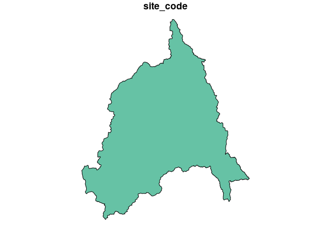
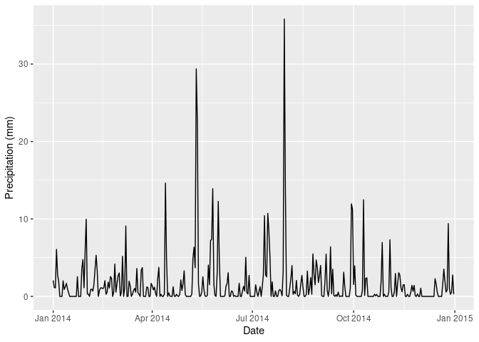

This walkthrough is intended for someone with a basic understanding of
hydrology who whats to calculate basin average precipitation from a few
rain gauges in or near a watershed. We recommend looking at one of our
other walkthroughs **(MacroSheds Discharge and Chemistry Data Retrieval
and Flux Calculation )** to get an understanding of how to use the
MacroSheds dataset in conjunction with the package.

For this walkthrough we will use the National Oceanic and Atmospheric
Administration’s Global Historical Climate Network- Daily dataset, via
the rnoaa package, to locate precipitation gauges in our area of
interest, the Cache La Poudre watershed at Fort Collins, CO.

# Install and explore the `macrosheds` package

To use the `macrosheds` package, you must first **make sure you have the
`macrosheds` package on your computer, built, and installed in R**.
Currently, the package is only available via github. If you have not
already, you can install the `macrosheds` package as follows:

    # install.packages('devtools') #you may need to install devtools too

    devtools::install_github("https://github.com/MacroSHEDS/macrosheds")

Now, that we have the `macrosheds` package, we load it into our library,
along with other packages we will be using in this walkthrough.

    library(rnoaa)
    library(sf)
    library(lubridate)
    library(macrosheds)
    library(ggplot2)
    library(tidyverse)

# Locate and download NOAA data

This is a helper function used to search NOAA’s Global Historical
Climate Network- Daily dataset for gauges near a location with the rnoaa
package. You can skip over this part unless you’re interested in
downloading other data from NOAA.

    search_noaa_stations <- function(lat, long, noaa_sites, buffer_km, start_year, end_year) {
        
        # Site = an sf object with a minimum of the columns: site_code and geometry
        # noaa_sites = an sf object with NOAA site info, made above 
        # buffer_km = the maximum distance from a stream gauge that will be searched 
        #     for NOAA site
        # start_year = numeric of when NOAA data should start (set same as stream start date)
        # end_year = numeric of when NOAA data should have data through (set same as stream end date)
        
        site <- tibble(lat = lat, long = long) %>%
            sf::st_as_sf(coords = c('long', 'lat'), crs = 4326) 
        
        buffer_m <- buffer_km*1000
        site_buf <- site %>%
            st_buffer(buffer_m)
        
        near_noaa <- st_filter(noaa_station_sf, site_buf)
        
        
        near_noaa_time <- near_noaa %>%
            filter(first_year <= start_year,
                   last_year >= end_year)
        
        if(nrow(near_noaa_time) == 0){
            print(paste0('No station was found within ', buffer_km, ' km of site: ', site$site_code))
            return(list(data = tibble(),
                        relation = tibble(site_code = site$site_code,
                                          NOAA_id = NA,
                                          distance_km = NA)))
        }
        
        
        near_noaa_time <- near_noaa_time %>%
            mutate(distance = as.numeric(st_distance(geometry, site$geometry)))

        return(near_noaa_time)
    }

    download_clean_noaa_data <- function(noaa_ids) {
        
        noaa_data <- rnoaa::ghcnd(stationid = noaa_ids)
        
        col_names <- names(noaa_data)
        
        col_names[5:128] <- paste0(substr(col_names[5:128], 0, 5), '_', substr(col_names[5:128], 6, 7))
        
        colnames(noaa_data) <- col_names
        
        noaa_data_clean <- noaa_data %>%
            filter(element %in% c('TMAX', 'TMIN', 'PRCP'))
        
        noaa_data_clean_VALUE <- noaa_data_clean %>%
            select(id, year, month, element, grep('VALUE', col_names[5:128], value = T)) %>%
            pivot_longer(cols = grep('VALUE', col_names[5:128], value = T), values_to = 'VALUE') %>%
            mutate(day = str_split_fixed(name, '_', n = Inf)[,2]) %>%
            select(-name)
        
        noaa_data_clean_MFLAG <- noaa_data_clean %>%
            select(id, year, month, element, grep('MFLAG', col_names[5:128], value = T)) %>%
            pivot_longer(cols = grep('MFLAG', col_names[5:128], value = T), values_to = 'MFLAG') %>%
            mutate(day = str_split_fixed(name, '_', n = Inf)[,2]) %>%
            select(-name)
        
        noaa_data_clean_QFLAG <- noaa_data_clean %>%
            select(id, year, month, element, grep('QFLAG', col_names[5:128], value = T)) %>%
            pivot_longer(cols = grep('QFLAG', col_names[5:128], value = T), values_to = 'QFLAG') %>%
            mutate(day = str_split_fixed(name, '_', n = Inf)[,2]) %>%
            select(-name)
        
        noaa_data_clean_SFLAG <- noaa_data_clean %>%
            select(id, year, month, element, grep('SFLAG', col_names[5:128], value = T)) %>%
            pivot_longer(cols = grep('SFLAG', col_names[5:128], value = T), values_to = 'SFLAG') %>%
            mutate(day = str_split_fixed(name, '_', n = Inf)[,2]) %>%
            select(-name)
        
        all_noaa <- full_join(noaa_data_clean_VALUE, noaa_data_clean_MFLAG, by = c('id', 'year', 'month', 'day', 'element')) %>%
            full_join(., noaa_data_clean_QFLAG, by = c('id', 'year', 'month', 'day', 'element')) %>%
            full_join(., noaa_data_clean_SFLAG, by = c('id', 'year', 'month', 'day', 'element')) %>%
            filter(!is.na(VALUE)) %>%
            mutate(date = lubridate::ymd(paste0(year, '-', month, '-', day))) %>%
            mutate(VALUE = VALUE/10) %>%
            select(NOAA_id = id, date, element, VALUE, MFLAG, QFLAG, SFLAG) 
        
        return(all_noaa)
    }

We need the file that has the location of all gauges in the NOAA
database, so we’ll use the `rnoaa::ghcnd_stations` function to pull that
data and convert it to an sf object. Then we can do geospatial filters
on the data.

    noaa_station <- rnoaa::ghcnd_stations()
    # Only want sites that have temperature measurements
    noaa_station_all_vars <- noaa_station %>%
        filter(element %in% c('PRCP'))

    # Conver to sf object
    noaa_station_sf <- noaa_station %>% 
        filter(id %in% !!unique(noaa_station_all_vars$id)) %>%
        distinct(id, .keep_all = T) %>% 
        sf::st_as_sf(., coords = c('longitude', 'latitude'), crs = 4326)

Now we’ll search for stations 30km from the center of the Poudre
watershed

    near_stations <- search_noaa_stations(lat = 40.694473, long = -105.499921,
                                          noaa_sites = noaa_station_sf, buffer_km = 30,
                                          start_year = 2000, 2018)

Next we’ll download the precipitation data for these stations. This
function will download noaa precipitation (PRCP), daily maximum (TMAX),
and daily minimum (TMIN) temperature. NOAA provides this data in units
of tenths of mm and tenths of degrees. The function will convert these
units to mm and degrees C

    noaa_precip_data <- download_clean_noaa_data(noaa_ids = near_stations$id)

Precipitation data needs to be in the MacroSheds format to use the
`ms_calc_watershed_precip` function. This format is a table with the
columns: site\_code = code for gauge

datetime = datetime of the observation

var = variable observed

val = value of observation

ms\_status = 0 to indicate no issue, 1 to indicate possible issue

ms\_interp = 0 to indicate the value was measured, 1 to indicate the
value is interpolated from surrounding values

val\_err = uncertainty unknown with observation, can set to 0 is unknown

We will also remove gauges that have more than 10% of their record
missing in 2014

    ms_noaa_precip_data <- noaa_precip_data %>%
        filter(element == 'PRCP') %>%
        select(site_code = NOAA_id,
               datetime = date,
               var = element,
               val = VALUE) %>%
        mutate(ms_status = 0,
               ms_interp = 0,
               val_err= 0)  %>%
        mutate(var = 'IS_precipitation') %>%
        filter(year(datetime) == 2014)

    # Check to make sure the precipitation records are mostly complete for 2014
    complete_records <- ms_noaa_precip_data %>% 
        group_by(site_code) %>% 
        summarise(n = n()) %>%
        # Filter out any sites with more than 10 % of the record missing 
        filter(n >= 329) %>%
        pull(site_code)

    ms_noaa_precip_data <- ms_noaa_precip_data %>%
        filter(site_code %in% !!complete_records)

    gauges_with_data <- unique(ms_noaa_precip_data$site_code)

We also need an sf object in the MacroSheds format with the locations of
precipitation gauges. Macrosheds format for geospatial data is an `sf`
object with the columns: site\_code = code for site

geometry = geospatial informaiton for shape/point

We can use the NOAA site data and convert it to MacroSheds format.

    ms_near_stations <- near_stations %>%
        select(site_code = id,
               geometry) %>%
        filter(site_code %in% !!gauges_with_data)

# Look at watershed of interest

The last piece we need is a watershed boundary. The Poudre watersheds is
included in MacroSheds as an example but see the data documentation for
how to retrieve a watersheds using nhdplusTools.

    ?poudre_ws
    print(poudre_ws)

    ## Simple feature collection with 1 feature and 1 field
    ## Geometry type: POLYGON
    ## Dimension:     XY
    ## Bounding box:  xmin: -105.9301 ymin: 40.41144 xmax: -105.0441 ymax: 41.21038
    ## Geodetic CRS:  NAD83
    ##      site_code                       geometry
    ## 1 poudre_river POLYGON ((-105.7823 40.7881...

    plot(poudre_ws)

# Calculate basin average precipitation

Now we have everything we need! Let’s put the data into the
`ms_calc_watershed_precip` function! `ms_calc_watershed_precip` uses
inverse distance weighting (IDW) over a raster grid to estimate a
measurement of precipitation for every raster cell in a watershed. The
function then takes an average over the whole watershed for every time
interval (daily for this example).

`ms_calc_watershed_precip` also has a few arguments that are important
to note. First, `parallel = TRUE` will run the function in parallel.
Parallel processing is a way to leverage multiple cores on your computer
to perform computationally intensive processing more quickly, by doing
multiple processes at once. For more information on parallel computing
in R take a look at this link:
<https://nceas.github.io/oss-lessons/parallel-computing-in-r/parallel-computing-in-r.html>

The other important argument to pay attention to is
`elevation_agnostic`. When `elevation_agnostic = TRUE`,
`ms_calc_watershed_precip` will interpolate precipitation based purely
on IDW. When `elevation_agnostic = FALSE`, the function uses a linear
regression between precipitation at a gauge and elevation to predict
precipitation in a digital elevation model (DEM) of the watershed. Then
the function takes the average between the IDW raster and regression
between precipitation and elevation to calculate basin average
precipitation. This may be useful when calculating precipitation in a
basin that has a significant relationship between elevation and
precipitation.

    ms_calc_watershed_precip(precip = ms_noaa_precip_data,
                             ws_boundary = poudre_ws,
                             precip_gauge = ms_near_stations,
                             parallel = TRUE,
                             maxcores = Inf,
                             out_path = 'example',
                             elevation_agnostic = TRUE,
                             verbose = FALSE)

    ## Warning: PROJ support is provided by the sf and terra packages among others

    ## Warning: PROJ support is provided by the sf and terra packages among others

    ##  Accessing raster elevation [-------------------------]   0% Accessing raster elevation [=====>-------------------]  25% Accessing raster elevation [===========>-------------]  50% Accessing raster elevation [==================>------]  75% Accessing raster elevation [=========================] 100%
    ## Mosaicing & Projecting
    ## Clipping DEM to bbox

    ## Warning: PROJ support is provided by the sf and terra packages among others

    ## Warning: PROJ support is provided by the sf and terra packages among others

Let’s look at the data!

    pourdre_precip <- feather::read_feather('example/precipitation__ms900/poudre_river.feather')
    head(pourdre_precip)

    ## # A tibble: 6 × 7
    ##   datetime   site_code    var                val ms_status ms_interp val_err
    ##   <date>     <chr>        <chr>            <dbl>     <dbl>     <dbl>   <dbl>
    ## 1 2014-01-01 poudre_river IS_precipitation  2.06         0         0       0
    ## 2 2014-01-02 poudre_river IS_precipitation  1.13         0         0       0
    ## 3 2014-01-03 poudre_river IS_precipitation  1.11         0         0       0
    ## 4 2014-01-04 poudre_river IS_precipitation  6.07         0         0       0
    ## 5 2014-01-05 poudre_river IS_precipitation  2.78         0         0       0
    ## 6 2014-01-06 poudre_river IS_precipitation  1.91         0         0       0

    ggplot(pourdre_precip, aes(datetime, val)) +
        geom_line() +
        labs(x = 'Date', y = 'Precipitation (mm)')

