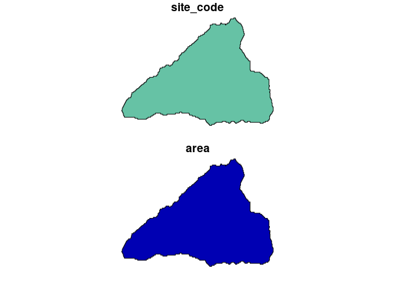

Step 1: load the `macrosheds` package.

*See the ms\_retrieval\_flux\_calc vignette for an introduction to the
package.*

    library(macrosheds)

We use `elevatr` to retrieve digital elevation models (DEMs) and
WhiteboxTools for DEM conditioning, pour point snapping, flow
accumulation, and delineation itself. The `whitebox` package requires
binaries that aren’t shipped with the CRAN package, but you can install
them like so:

    whitebox::install_whitebox()

    ## WhiteboxTools binary is located here:  /home/weston/R/x86_64-pc-linux-gnu-library/4.2/whitebox/WBT/whitebox_tools

## Delineation without prior information

To delineate a watershed with no prior knowledge of its area, road
density, etc., you don’t need to supply many arguments. Just latitude,
longitude, and their coordinate reference system. If you don’t know the
CRS, try 4326 (WGS 84). If you run this as-is, it’ll create a new folder
called ‘my\_watershed\_boundaries’ in your home directory. Feel free to
change that.

        out <- ms_delineate_watershed(
            lat = 44.21013,
            long = -122.2571,
            crs = 4326,
            write_dir = '~/my_watershed_boundaries',
            write_name = 'example_site'
        )

This candidate doesn’t look like much of a watershed. Maybe the default
snap distance wasn’t enough to get our point to the streamline. Type “D”
and hit \[enter\]. Then type “100” and hit \[enter\].

Nope. Same thing. Maybe the DEM resolution isn’t fine enough for it to
find the stream. Try “R” \[enter\], “10” \[enter\].

Okay, we got something different, but it’s still not the watershed of
the stream that our point is on. But look, there are two candidates this
time, and it’s telling us to press \[enter\] to see the other one… and
there it is!

Now you might want to scan around the edges and verify that the
delineator hasn’t stopped at any bridges or dams. If it has, you can try
again with “S”, which burns streams into the DEM. If you’re satisfied,
type “2” and hit \[enter\].

Of course you’d see the watershed interactively during the delineation,
but here’s how you can load the shapefile afterward and and view it.

    library(sf)
    st_read('~/my_watershed_boundaries/example_site.shp', quiet = TRUE) %>% 
        plot()

And here are the contents of `out`:

    $out_path
    [1] "~/my_watershed_boundaries"

    $filename_base
    [1] "example_site"

    $watershed_area_ha
    [1] 6219.831

    $deets
    $deets$name
    [1] "example_site"

    $deets$buffer_radius_m
    [1] 1000

    $deets$snap_distance_m
    [1] 150

    $deets$snap_method
    [1] "standard"

    $deets$dem_resolution
    [1] 10

    $deets$flat_increment
    [1] "null"

    $deets$breach_method
    [1] "basic"

    $deets$burn_streams
    [1] FALSE

It includes the path to the shapefile, the watershed area, and all the
specifications of the successful delineation.

## Delineation with partial information

If you knew in advance that a watershed was on the order of 50,000
hectares, you could start with a larger DEM than the default. By
default, a DEM will be downloaded that covers the circle defined by the
buffer radius. So for a watershed of 50,000 ha, you’d have a radius of
~11,000 meters (`sqrt(5e8) / 2`). You could specify
`buffer_radius_m = 11000`. If this still isn’t large enough (if the
delineation reaches the edge of the DEM), a larger DEM will be retrieved
automatically.

Any parameter you specify won’t have to be searched, so specify whatever
you can. Of course, some parameters like `flat_increment` and
`snap_method` aren’t very intuitive. It’s fine to omit any parameters
too.

## Delineation with complete information

If you were to run the delineation above again for whatever reason, you
wouldn’t want to wait for the first attempt before specifying the
parameters that get the job done. You can glean these by looking at the
output above. Let’s specify them all, and since we already know the
outcome of this run, there’s no need to be prompted for anything–let’s
set `confirm = FALSE`.

        out <- ms_delineate_watershed(
            lat = 44.21013,
            long = -122.2571,
            crs = 4326,
            write_dir = '~/my_watershed_boundaries',
            write_name = 'example_site',
            spec_buffer_radius_m = 1000,
            spec_snap_distance_m = 150,
            spec_snap_method = 'standard',
            spec_dem_resolution = 10,
            spec_flat_increment = NULL,
            spec_breach_method = 'basic',
            verbose = FALSE,
            confirm = FALSE
        )

    ##  Accessing raster elevation [-------------------------]   0% Accessing raster elevation [=========================] 100%
    ## Mosaicing & Projecting

    ## fill_single_cell_pits - Elapsed Time (excluding I/O): 0.1s
    ## breach_depressions - Elapsed Time (excluding I/O): 0.45s
    ## d8_pointer - Elapsed Time (excluding I/O): 0.2s
    ## d8_flow_accumulation - Elapsed Time (excluding I/O): 0.9s
    ## snap_pour_points - Elapsed Time (excluding I/O): 0.0s
    ## watershed - Elapsed Time (excluding I/O): 0.6s

    ## Delineation successful and confirm == FALSE. Writing shapefile to ~/my_watershed_boundaries
